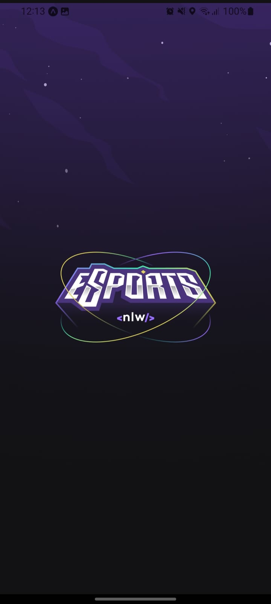
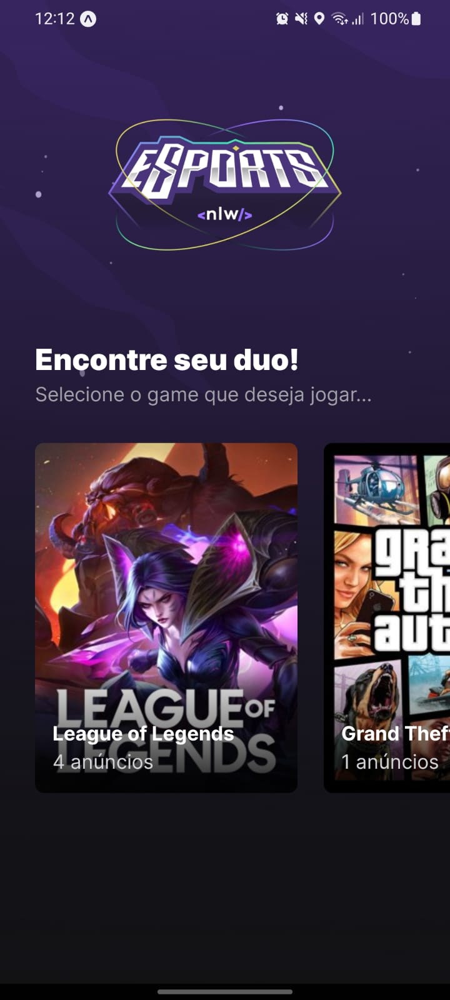
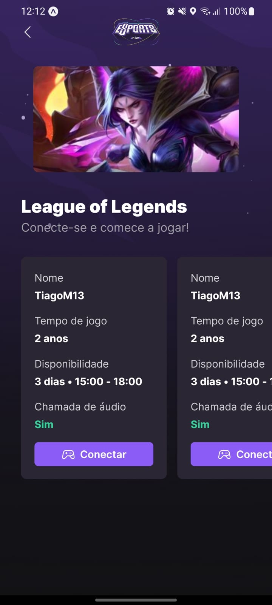
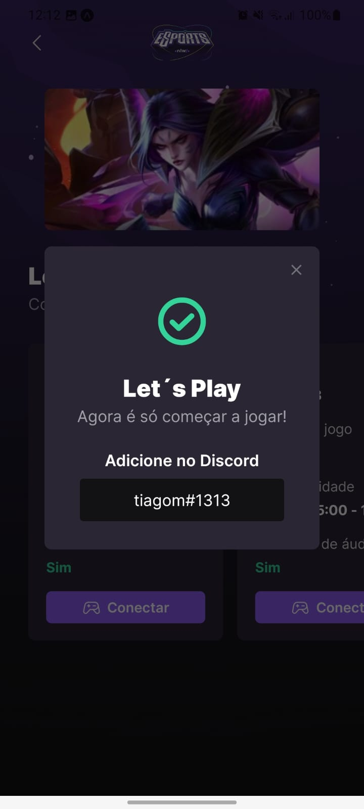

# NLW eSports - Aplicação Mobile - React Native

Aplicação feita em React Native, aplicativo mobile para listar os games e anúncios criados, podendo se conectar com outras pessoas atráves do discord. a apliacação utiliza a API do repositório: [eSports_server](https://github.com/TiagoM13/eSports_server), para poder listar os games e anúncios e também poder obter o código do discord do usuário (ID). 

Está aplicação foi construida utilizando diversas bibliotecas conhecidas no mercado!

## 📸 Layout da Aplicação 

  Imagens do layout da aplicação:

  

    
    
    
    
  

## 🛠️ Ferramentas Utilizadas

  - React Native
  - React Hooks
  - React Navigation
  - React Native Screens
  - Phosphor React Native
  - Typescript 
  - Expo Fonts
  - Expo
  
